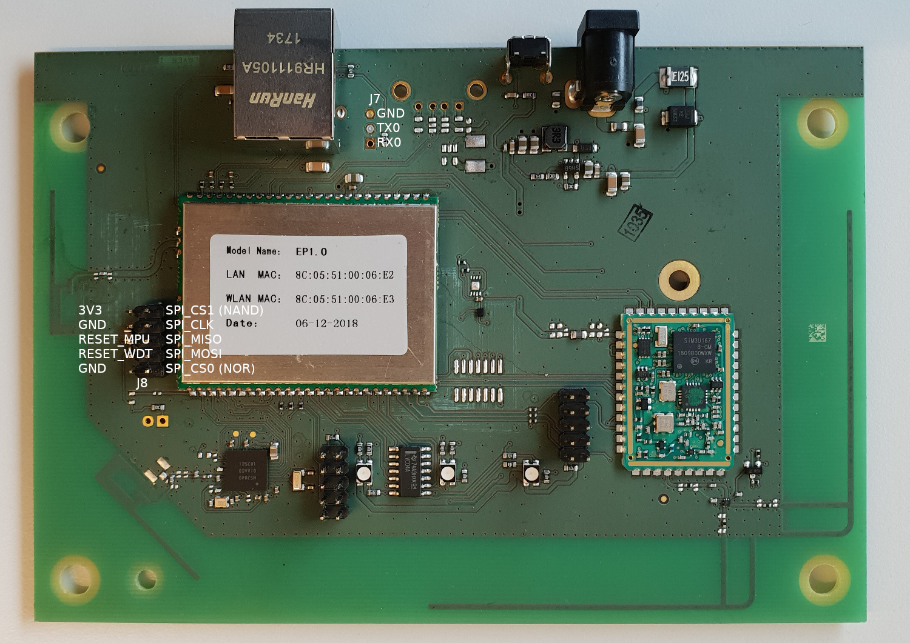

# Foreword
Please be aware that any modification to your gateway, in particular a modification of U-Boot, may permanently brick your device and is not covered by warranty.

# Compiling the Software

## Obtaining the Source Code

The source code of this project is maintained with git.

```
git clone --recurse-submodules <repository>
cd smart-garden-gateway-public
```
Optionally, specific versions can be checked out (5.5.1 in this case):
```bash
git checkout release/linux-system-5.5.1
```

Older versions of the build system can be found in the history. However, only for the most recent master we intend to ensure that the build works.

Source code packages for all distributed versions can be found [here](https://opensource.smart.gardena.dev/gateway/index.html).

## Prerequisites

* The Yocto build host packages need [to be installed](https://www.yoctoproject.org/docs/2.5.1/brief-yoctoprojectqs/brief-yoctoprojectqs.html#brief-build-system-packages)

## Build Instructions

### Article Number 19005 (MediaTek MT7688)
```bash
scripts/bbwrapper.sh mt7688 gardena-image-opensource-prod linux-yocto-tiny
```

## Repository Layout

* ```/``` Top level project.
    * ```/yocto/bitbake``` – the Bitbake build tool
    * ```/yocto/openembedded-core``` – OpenEmbedded core layer
    * ```/yocto/meta-mediatek``` – the MediaTek Board Support Package (BSP), used only for Art. No. 19005
    * ```/yocto/meta-distribution``` – our own distribution (specifies packages to install)
    * ```/yocto/meta-gardena``` – our own code (testing, WiFi provisioning, etc.)
    * ```/yocto/meta-openembedded``` – Collection of layers for the OE-core universe
    * ```/yocto/meta-readonly-rootfs-overlay``` – Writable rootfs overlay on top of a read-only rootfs
    * ```/yocto/meta-swupdate``` – Update mechanism software
    * ```/yocto/meta-atmel``` – our Atmel Board Support Package (BSP), used only for Art. No. 19000

# Getting access

## Art. No. 19005
The serial port can be found on J7. Settings are 115200 8N1, the level is 3.3V.



Once connected, simply follow the instructions printed during startup.

Alternatively, right after powering up a gateway, pressing any key will grant access to the U-Boot shell.

## Art. No. 19000
We do not provide (yet!) any help rooting this device. The internet however does.

# Flashing

## Article Number 19005 (MediaTek MT7688)
The easiest way to install a self-built kernel and rootfs is to fetch the images over the network from within U-Boot,
using TFTP.

Ideally, the TFTP server (e.g. [tftp-hpa](https://git.kernel.org/pub/scm/network/tftp/tftp-hpa.git)) and the DHCP server
(e.g. [dnsmasq](https://thekelleys.org.uk/dnsmasq/doc.html)) run on the same machine, allowing the following steps to
work:
- Attach UBI device: `ubi part nand`
- Fetch kernel and rootfs via TFTP, store it in the active UBI partitions:
  - `dhcp fitImage-gardena-sg-mt7688.bin && ubi write ${fileaddr} kernel${bootslot} ${filesize}`
  - `dhcp gardena-image-opensource-prod-gardena-sg-mt7688.squashfs-xz && ubi write ${fileaddr} rootfs${bootslot} ${filesize}`
- Prevent "updates" to proprietary image: `env set update_url updates-disabled && saveenv`
  (run `env set update_url && saveenv` to re-enable updates)
- Restart gateway: `reset`

## Proprietary Bits
It is possible to install the proprietary packages via OPKG by doing the following on the Linux shell:
- Adjust OPKG feeds to your gateway \<version>:
  ```bash
  sed -i 's|gateway-dev.iot.sg.dss.husqvarnagroup.net/continuous/master|gateway.iot.sg.dss.husqvarnagroup.net/archive/<version>|' /etc/opkg/base-feeds.conf
  ```
- Update the OPKG feeds: `opkg update`
- Install the packages:
  ```bash
  opkg install shadoway python3-lemonbeat otau gateway-config-backend gateway-config-frontend accessory-server
  ```
- Reboot gateway: `reboot`